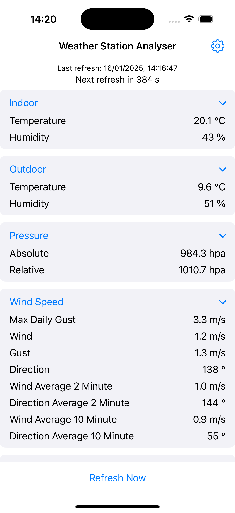
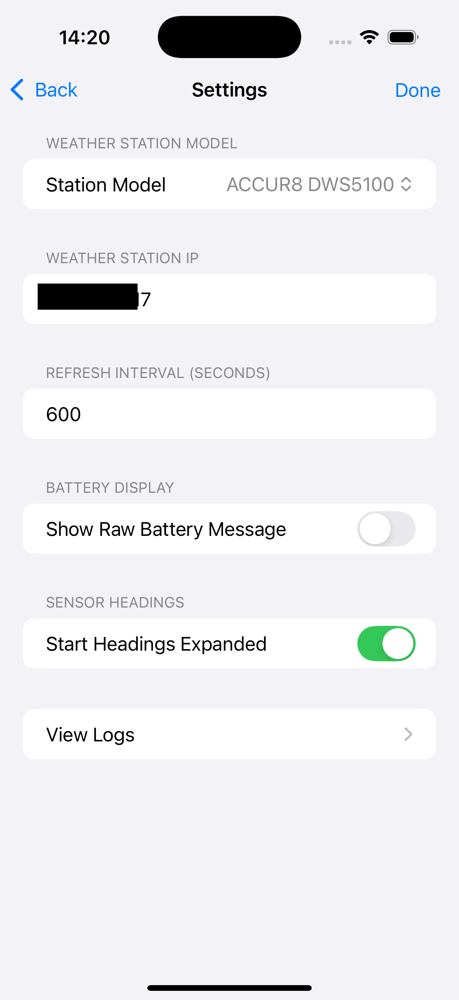

# ACCUR8 / WeatherRouter local API

Read live data from an ACCUR8 DWS5100 (or any other weather station built on the CCL "WeatherRouter" SoC) over your own network, with the station blocked from the internet.

    curl "http://<station-ip>/client?command=record"

That returns every current reading as JSON. No account on wunderground.com or weathercloud.net, no cloud, no Docker, no Home Assistant needed. Examples for WeeWX, Home Assistant and a plain Python poller are below.

## Background

My wife got me an ACCUR8 DWS5100 5-in-1 weather station for Christmas. Before letting it online I had a look at what it exposes, and decided to block its internet access. The manual only describes uploading to wunderground.com or weathercloud.net, and every guide I found relied on one of those services. So I read the firmware's web pages and found the local endpoint.

The configuration page loads `setting.js` and `common.js`. `common.js` links to a `record.html` page labelled "Live Data" that does not exist on the device. Guessing at `record.js` worked, and it contains two calls:

    client?command=record
    client?command=rec_refresh

`record` returns the full set of current values. `rec_refresh` appears to return only changed values (the numeric fourth element on the rainfall rows looks like the field id it keys on). I have not mapped `rec_refresh` yet.

## Compatibility

ACCUR8 is a white-label name. The SoC is CCL's WeatherRouter and the same firmware ships under several brands. Confirmed working:

| Station | Firmware | Notes |
|---|---|---|
| ACCUR8 DWS5100 5-in-1 | WeatherRouter V1.2.x | Author's station |

If it works on yours, open an issue with the brand, model and firmware version so the table can grow.

## The JSON

Units follow whatever is set on the console, and the unit string is included with every value, so check it rather than assuming metric.

    {
      "sensor": [
        {"title": "Indoor",   "list": [["Temperature", "20.3", "°C"], ["Humidity", "43", "%"]]},
        {"title": "Outdoor",  "list": [["Temperature", "9.9", "°C"], ["Humidity", "38", "%"]]},
        {"title": "Pressure", "list": [["Absolute", "985.6", "hpa"], ["Relative", "1012.0", "hpa"]]},
        {"title": "Wind Speed", "list": [
          ["Max Daily Gust", "3.3", "m/s"],
          ["Wind", "0.9", "m/s"],
          ["Gust", "1.0", "m/s"],
          ["Direction", "216", "°"],
          ["Wind Average 2 Minute", "0.8", "m/s"],
          ["Direction Average 2 Minute", "243", "°"],
          ["Wind Average 10 Minute", "0.4", "m/s"],
          ["Direction Average 10 Minute", "271", "°"]
        ]},
        {"title": "Rainfall", "list": [
          ["Rate", "0.0", "mm/hr"],
          ["Hour", "0.0", "mm", "43"],
          ["Day", "0.0", "mm", "44"],
          ["Week", "3.0", "mm", "45"],
          ["Month", "3.0", "mm", "46"],
          ["Year", "3.0", "mm", "47"],
          ["Total", "3.0", "mm", "48"]
        ], "range": "Range: 0mm to 9999.9mm. "},
      ],
      "battery": {"title": "Battery", "list": ["All battery are ok"]}
    }

Each reading is `[name, value, unit]`; the rainfall rows carry an extra field id. Values are strings. `range` is a validation hint from the firmware's own UI.

## WeeWX driver

`weewx/weatherrouter.py` polls the endpoint and emits loop packets in METRICWX units. It reads the unit string on every value and converts, so the driver works whichever display units the console is set to. Rain is reported as the change in the station's lifetime total between polls, which is what WeeWX expects.

Copy the file into the WeeWX user directory (`bin/user/` on WeeWX 4, `/etc/weewx/bin/user/` on a WeeWX 5 package install) and add to `weewx.conf`:

    [Station]
        station_type = WeatherRouter

    [WeatherRouter]
        driver = user.weatherrouter
        url = http://<station-ip>/client?command=record
        poll_interval = 60

Restart weewx. To test outside WeeWX:

    python3 weatherrouter.py http://<station-ip>/client?command=record

Fields populated: inTemp, inHumidity, outTemp, outHumidity, pressure (absolute), barometer (relative), windSpeed, windGust, windDir, rainRate, rain, outTempBatteryStatus. The 2 and 10 minute wind averages are not used because WeeWX computes its own.

## Home Assistant

A `rest` sensor does the job without any custom integration. Example for outdoor temperature and humidity:

    rest:
      - resource: http://<station-ip>/client?command=record
        scan_interval: 60
        sensor:
          - name: "Weather station outdoor temperature"
            unit_of_measurement: "°C"
            device_class: temperature
            value_template: "{{ value_json.sensor[1].list[0][1] }}"
          - name: "Weather station outdoor humidity"
            unit_of_measurement: "%"
            device_class: humidity
            value_template: "{{ value_json.sensor[1].list[1][1] }}"
          - name: "Weather station relative pressure"
            unit_of_measurement: "hPa"
            device_class: pressure
            value_template: "{{ value_json.sensor[2].list[1][1] }}"

Index positions match the JSON above. Adjust `unit_of_measurement` if your console is set to imperial.

## Python poller

`examples/poll.py` prints all readings as a table every 10 seconds.

    pip install -r requirements.txt
    python3 examples/poll.py <station-ip>
    python3 examples/poll.py <station-ip> --once

## Security notes

Everything the station serves is unauthenticated on port 80. That includes the setup page, which shows the configured upload credentials in the clear. Treat the station as an untrusted device: give it a fixed IP, block it at the firewall from reaching the internet, and only poll it from your LAN.

## iOS app

A small app that polls the station directly. It is a personal project, not released, shown here for reference.

 

## Licence

MIT, see `LICENSE`.
