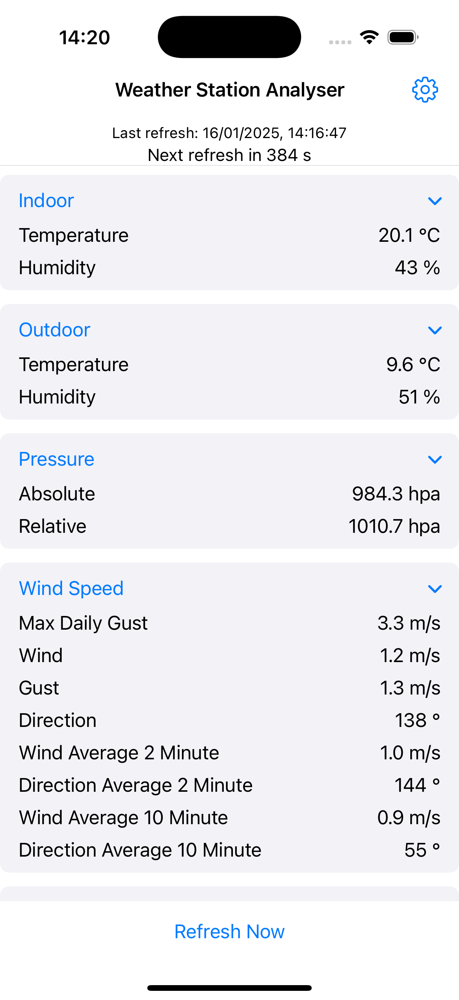

# iOS App
I'm working on an iOS app to display the data direct from my weather station on my phone. It's a work in progress. It's currently working on my home network and when I'm on my VPN. 

Screenshots:

